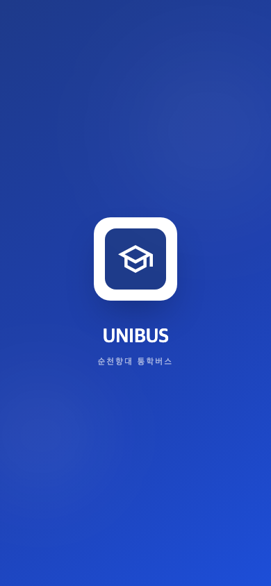
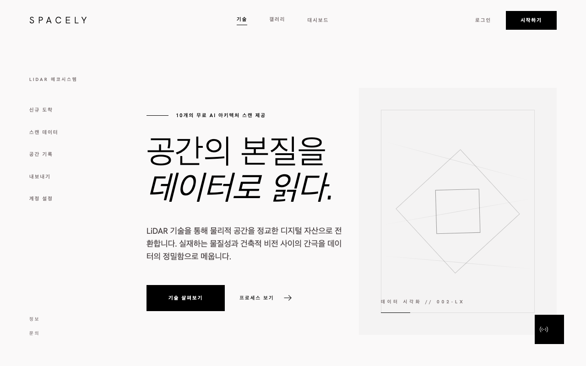

# Jaewon Kwon

Frontend-heavy full-stack developer. Building real products with React, TypeScript, and modern backend infrastructure.

---

## Projects

### UNIBUS — 대학교 셔틀버스 시스템

Campus shuttle bus tracking and management app for students and administrators.

**What it does:** Real-time bus location tracking on Naver Maps, QR-based boarding, commuter bus schedules, admin dashboard with route management, push notifications, and multilingual support (KO/EN).

        

---

### 먹깨비 — 소셜 푸드 다이어리

Take a photo of your food → AI removes the background → physics-powered sticker board shared with friends in real time.

**What it does:** Remove.bg API strips the background from food photos. Gemini AI generates a one-line food description. Stickers land on a physics board with gravity, collision, and bounce. Tilt or shake your phone to move stickers. Friends join via invite code and share the same live board.

       

---

### Spacely — iOS LiDAR → 3D Web Viewer

Scan a room with your iPhone, view it as an interactive 3D model in the browser.

**What it does:** iOS app uses Apple RoomPlan (LiDAR) to scan walls, surfaces, and objects. Scan data is uploaded to Supabase. Web viewer renders the room in 3D with orbit controls, and also displays a 2D floor plan.

      

---

## Skills

**Languages**  
  

**Frontend**  
    

**Backend**  
  

**Database & Services**  
 

**Tools & Deploy**  
  

---

> Always building something.
